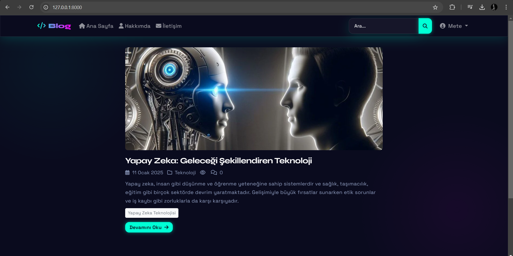
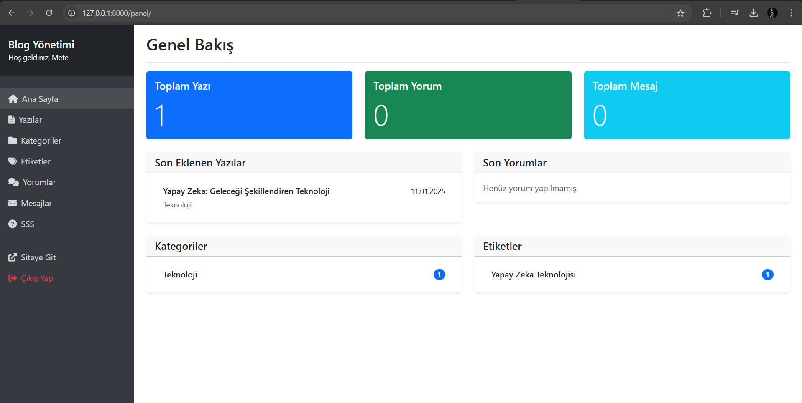
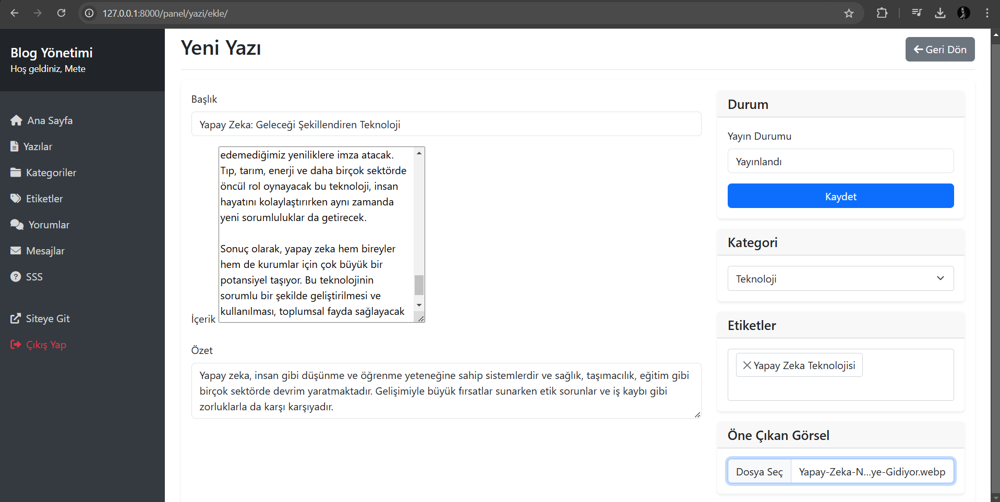
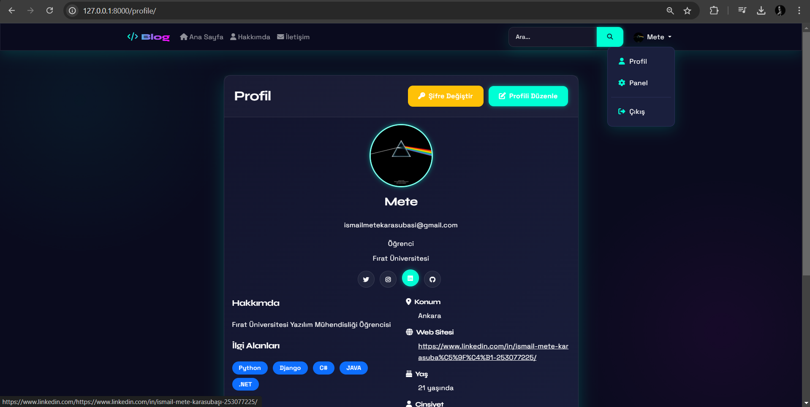
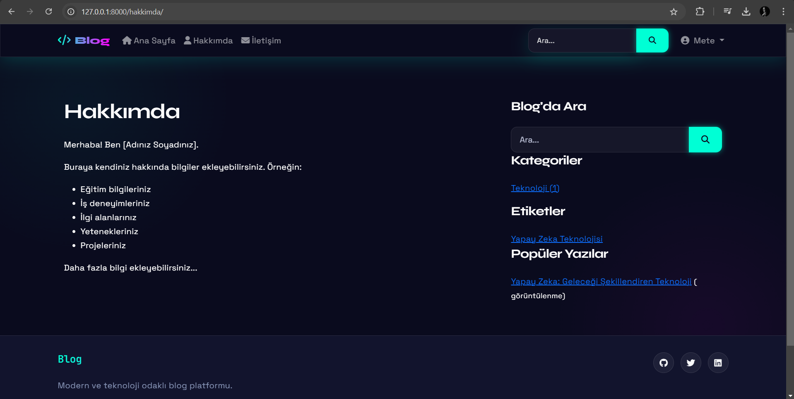
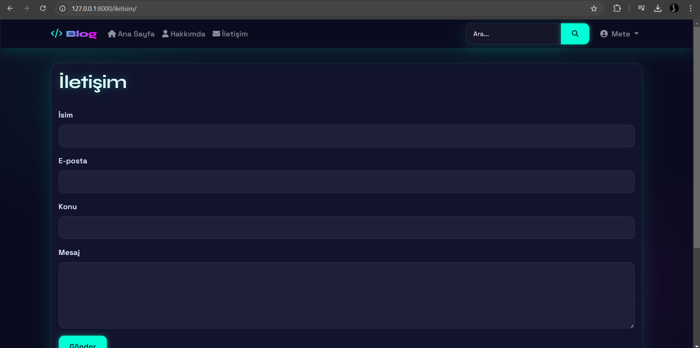

Modern Django Blog Projesi 🚀

Modern ve teknoloji odaklı bir blog platformu. Django 5.1 ve Bootstrap 5 ile geliştirilmiş, dark mode tasarıma sahip, kullanıcı dostu bir blog sistemi.

✨ Özellikler

📝 Blog Yönetimi
- Modern ve şık dark mode arayüz
- Zengin metin editörü (CKEditor) ile yazı oluşturma
- Kategori ve etiket sistemi
- Görüntülenme sayısı takibi
- Yorum sistemi

👤 Kullanıcı Yönetimi
- Özelleştirilebilir kullanıcı profilleri
- Sosyal medya entegrasyonu
- Güvenli şifre değiştirme ve sıfırlama sistemi
- E-posta doğrulama

🛠️ Admin Paneli
- Kapsamlı yönetim arayüzü
- İstatistik takibi
- İçerik moderasyonu
- Kullanıcı yönetimi

🎨 Modern Tasarım
- Responsive tasarım
- Dark mode
- Neon efektler
- Modern animasyonlar
- Kullanıcı dostu arayüz

🖼️ Ekran Görüntüleri

Ana Sayfa

*Modern dark mode tasarımlı ana sayfa*

Yönetim Paneli

*İstatistikler ve içerik yönetimi*

Yazı Ekleme

*Zengin metin editörü ile yazı ekleme*

Profil Sayfası

*Özelleştirilebilir kullanıcı profili ve sosyal medya bağlantıları*

Hakkımda Sayfası

*Kişisel bilgiler ve tanıtım*

### İletişim Formu

*Modern tasarımlı iletişim formu*

## 🛠️ Teknolojiler

- **Backend:** Django 5.1
- **Frontend:** Bootstrap 5, JavaScript
- **Veritabanı:** PostgreSQL
- **Editör:** CKEditor
- **Kimlik Doğrulama:** Django Allauth
- **Mail Servisi:** SMTP (Gmail)

## ⚙️ Kurulum

1. Repoyu klonlayın:
```bash
git clone https://github.com/yourusername/blog.git
cd blog
```

2. Virtual environment oluşturun:
```bash
python -m venv env
source env/bin/activate  # Linux/Mac
env\Scripts\activate     # Windows
```

3. Gereksinimleri yükleyin:
```bash
pip install -r requirements.txt
```

4. Veritabanını oluşturun:
```bash
python manage.py migrate
```

5. Admin kullanıcısı oluşturun:
```bash
python manage.py createsuperuser
```

6. Uygulamayı çalıştırın:
```bash
python manage.py runserver
```

🔒 Güvenlik Tavsiyeleri

- DEBUG modunu production ortamında kapatın
- SECRET_KEY'i güvenli bir şekilde saklayın
- ALLOWED_HOSTS'u production ortamında düzenleyin
- Güvenli bir PostgreSQL yapılandırması kullanın
- E-posta ayarlarını güvenli bir şekilde yapılandırın

🤝 Katkıda Bulunma

1. Bu repoyu fork edin
2. Yeni bir branch oluşturun (`git checkout -b feature/amazing`)
3. Değişikliklerinizi commit edin (`git commit -m 'Yeni özellik eklendi'`)
4. Branch'inizi push edin (`git push origin feature/amazing`)
5. Pull Request oluşturun

📝 Lisans

Bu proje MIT lisansı altında lisanslanmıştır. Detaylar için [LICENSE](LICENSE) dosyasına bakın.

📧 İletişim

İsmail Mete Karasubasi - [LinkedIn](https://www.linkedin.com/in/ismail-mete-karasubasi-253077225/) - ismailmetekarasubasi@gmail.com

Proje Linki: [https://github.com/yourusername/blog](https://github.com/MeteKarasubasi/Blog-Website)

---
⭐️ Bu projeyi beğendiyseniz yıldız vermeyi unutmayın! 
